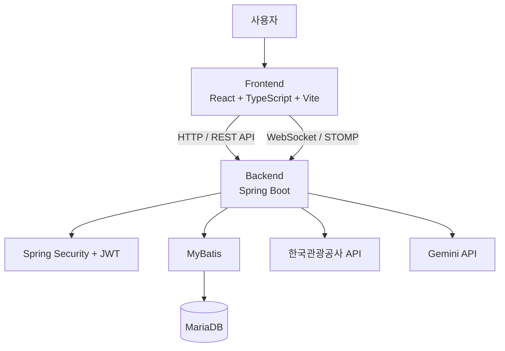
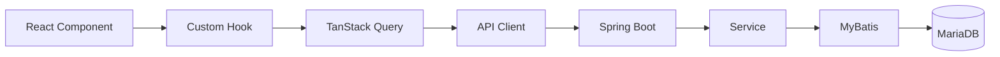
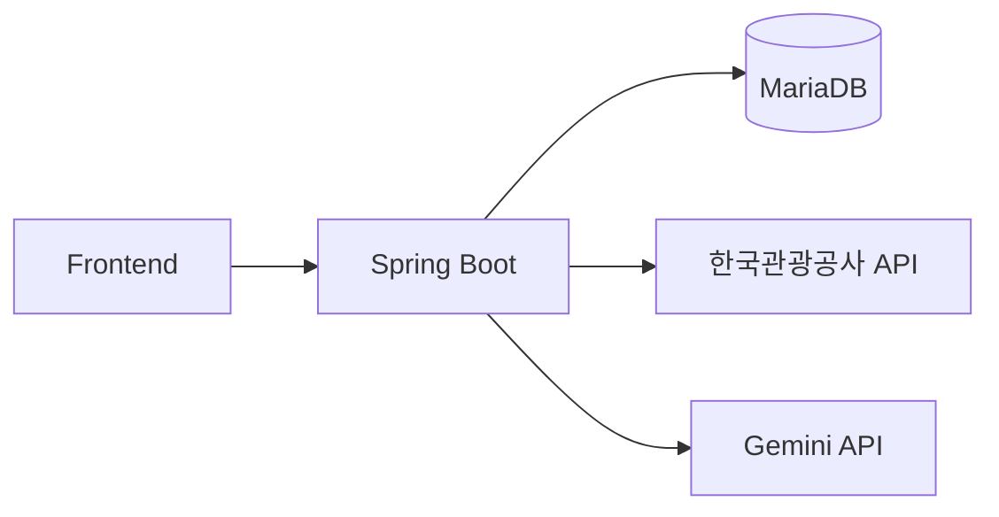
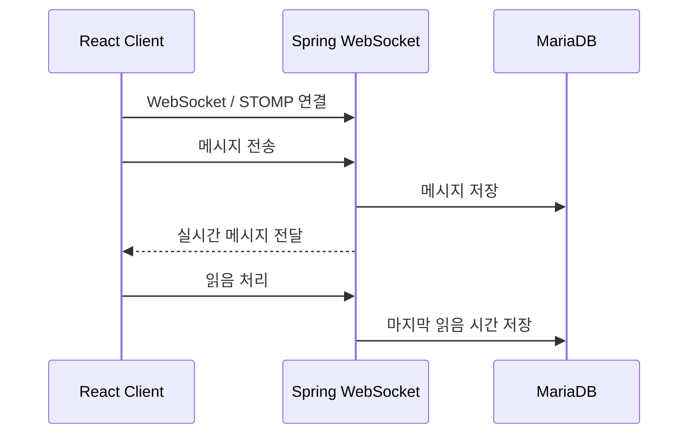

# 🗺️ TripMate

> 여행지 탐색부터 여행 소모임, 일정 관리와 실시간 채팅까지 한 곳에서 이용할 수 있는 여행 커뮤니티 서비스

TripMate는 여행지를 탐색하고, 관심 있는 여행지를 기반으로 여행 소모임을 찾아 다른 사용자와 함께 여행을 계획할 수 있도록 만든 여행 커뮤니티 서비스입니다.

한국관광공사 관광 데이터를 기반으로 여행지 정보를 제공하며, 여행지 상세 정보와 리뷰를 확인할 수 있습니다. 또한 지역과 조건에 따라 소모임을 탐색하고, 소모임 일정·참여자·리뷰·채팅 등을 통해 실제 여행 계획을 이어갈 수 있도록 구성했습니다.

AI를 활용한 여행지 및 소모임 검색/추천, 여행 일정 생성, 교통 추천 기능과 한국어/영어 다국어 지원도 제공합니다.

---

## ✨ 주요 기능

### 🏠 홈

- 인기 여행지 조회
- 인기 소모임 조회
- 여행 테마별 카테고리 제공
- 오늘의 여행 일정 확인
- 주요 여행지 및 소모임 화면 바로가기

### 📍 여행지

- 여행지 목록 조회
- 지역별 필터링
- 여행지 검색
- 무한 스크롤
- 여행지 상세 정보 조회
- 운영시간·휴무일·입장료·주차 등 이용 정보 제공
- 여행지 리뷰 조회 및 작성
- 여행지 평점 제공
- 지도 기반 위치 정보
- AI 기반 여행지 검색
- AI 기반 여행지 상세 정보
- AI 기반 여행 일정 생성
- AI 기반 교통 추천

### 👥 소모임

- 소모임 목록 조회
- 지역 및 조건별 필터링
- 소모임 검색
- 무한 스크롤
- 소모임 상세 정보 조회
- 소모임 생성
- 소모임 일정 관리
- 소모임 참여 신청
- 소모임 멤버 관리
- 내 소모임 조회
- 오늘의 소모임 일정 조회
- 소모임 리뷰 조회 및 작성
- AI 기반 소모임 검색 및 추천
- 소모임별 교통 추천

### 💬 채팅

- 채팅방 목록 조회
- 채팅방 입장 및 메시지 조회
- 실시간 메시지 전송
- 읽음 처리
- 읽지 않은 메시지 수 조회
- 채팅방 나가기
- STOMP 기반 WebSocket 통신
- 메시지 다국어 번역 지원

### 👤 사용자

- 회원가입
- 아이디 중복 확인
- 로그인 / 로그아웃
- 아이디 찾기
- 비밀번호 재설정
- 로그인 상태 확인
- 사용자 프로필 조회 및 수정
- 프로필 이미지 관리
- 사용 언어 관리
- 마이페이지
- 작성/참여 리뷰 조회
- 다른 사용자의 공개 프로필 조회

### 🔔 알림

- 소모임 신청 및 활동 관련 알림
- 알림 목록 조회
- 읽지 않은 알림 수 조회
- 알림 읽음 처리

### 🛡️ 안전 기능

- 소모임 내 사용자 신고
- 안심신고 등록

### 🌐 다국어

- 한국어 / 영어 지원
- `i18next` 및 `react-i18next` 기반 다국어 처리
- 여행지, 소모임, 리뷰, 채팅 등 주요 콘텐츠의 다국어 대응
- AI 번역 결과 캐시를 통한 반복 번역 최소화

### 🤖 AI 활용

- AI 여행지 검색 / 추천
- AI 여행지 상세 이용정보 생성
- AI 소모임 검색 / 추천
- AI 여행 일정 생성
- AI 교통 추천
- Gemini API 연동

---

## 🛠️ 기술 스택

### Frontend

| 기술 | 사용 목적 |
|---|---|
| React 19 | UI 개발 |
| TypeScript 6 | 정적 타입 관리 |
| Vite 8 | 개발 서버 및 빌드 |
| React Router 7 | 페이지 라우팅 |
| TanStack Query 5 | 서버 상태 및 비동기 데이터 관리 |
| React Hook Form 7 | Form 상태 관리 |
| i18next / react-i18next | 다국어 처리 |
| React Day Picker | 날짜 선택 UI |
| date-fns | 날짜 처리 |
| STOMP.js | WebSocket / 실시간 채팅 |
| CSS | UI 스타일링 |

### Backend

| 기술 | 사용 목적 |
|---|---|
| Java 17 | 백엔드 개발 |
| Spring Boot 4.0.6 | REST API 서버 |
| Spring Security | 인증 및 보안 |
| JWT | 사용자 인증 |
| MyBatis 3.0.4 | 데이터베이스 접근 |
| MariaDB | 데이터베이스 |
| Spring WebSocket | 실시간 통신 |
| STOMP | WebSocket 메시징 |
| Spring Validation | 요청 데이터 검증 |
| Swagger / OpenAPI | API 문서화 |
| JJWT 0.12.7 | JWT 생성 및 검증 |
| Lombok | 반복 코드 감소 |
| Gemini API | AI 기능 |
| 한국관광공사 API | 관광 데이터 제공 |

---

## 🏗️ 시스템 구조



### 데이터 처리 구조



외부 관광 데이터나 AI 기능이 필요한 경우 Backend에서 외부 API를 호출합니다.



---

## 📁 프로젝트 구조

```text
TripMate-main/
│
├── frontend/
│   ├── src/
│   │   ├── assets/
│   │   ├── features/
│   │   │   ├── auth/
│   │   │   ├── chat/
│   │   │   ├── guide/
│   │   │   ├── home/
│   │   │   ├── moim/
│   │   │   ├── my/
│   │   │   ├── notifications/
│   │   │   ├── notFound/
│   │   │   ├── place/
│   │   │   ├── search/
│   │   │   └── users/
│   │   │
│   │   ├── layouts/
│   │   ├── routes/
│   │   ├── shared/
│   │   │   ├── api/
│   │   │   ├── components/
│   │   │   ├── contexts/
│   │   │   ├── hooks/
│   │   │   ├── styles/
│   │   │   └── utils/
│   │   ├── locales/
│   │   ├── types/
│   │   ├── App.tsx
│   │   ├── i18n.ts
│   │   └── main.tsx
│   │
│   ├── public/
│   ├── package.json
│   └── vite.config.ts
│
└── backend/
    ├── src/
    │   ├── main/
    │   │   ├── java/
    │   │   │   └── com/example/backend/
    │   │   │       ├── config/
    │   │   │       ├── global/
    │   │       │   ├── exception/
    │   │       │   ├── jwt/
    │   │       │   └── security/
    │   │       │
    │   │       │   └── trma/
    │   │       │       ├── controller/
    │   │       │       ├── dto/
    │   │       │       ├── mapper/
    │   │       │       └── service/
    │   │       │
    │   │       └── resources/
    │   │           ├── mapper/
    │   │           └── schema/
    │   │
    │   └── test/
    │
    ├── build.gradle
    ├── settings.gradle
    ├── gradlew
    └── gradlew.bat
```

---

## 🧩 Backend API 구성

### 사용자 / 인증

| Method | Endpoint | 설명 |
|---|---|---|
| POST | `/login/existsUserId` | 아이디 중복 확인 |
| POST | `/login/findId` | 아이디 찾기 |
| POST | `/login/verifyReset` | 비밀번호 재설정 대상 확인 |
| POST | `/login/resetPassword` | 비밀번호 재설정 |
| POST | `/login/signup` | 회원가입 |
| POST | `/login/login` | 로그인 |
| POST | `/login/logout` | 로그아웃 |
| GET | `/login/authCheck` | 로그인 상태 확인 |
| GET | `/login/userDetail` | 사용자 상세 정보 |
| GET | `/login/reviewList` | 사용자 리뷰 목록 |

### 홈

| Method | Endpoint | 설명 |
|---|---|---|
| GET | `/trmaHome/userInfo` | 사용자 정보 |
| GET | `/trmaHome/bestTourList` | 인기 여행지 |
| GET | `/trmaHome/bestMoimList` | 인기 소모임 |

### 여행지

| Method | Endpoint | 설명 |
|---|---|---|
| GET | `/tourList/tourSearch` | 여행지 검색 |
| GET | `/tourList/tourAiSearch` | AI 여행지 검색 |
| GET | `/tourList/tourDetail` | 여행지 상세 |
| GET | `/tourList/tourAIDetail` | AI 여행지 상세 정보 |
| GET | `/tourList/tourDetailReview` | 여행지 리뷰 조회 |
| POST | `/tourList/tourDetailReview` | 여행지 리뷰 작성 |
| POST | `/tourList/aiSchedule` | AI 여행 일정 생성 |
| POST | `/tourList/customTour` | 사용자 지정 여행지 처리 |
| POST | `/tourList/transportRecommend` | 교통 추천 |

### 소모임

| Method | Endpoint | 설명 |
|---|---|---|
| GET | `/moimList/moimSearch` | 소모임 검색 |
| GET | `/moimList/moimAiSearch` | AI 소모임 검색 |
| GET | `/moimList/moimDetail` | 소모임 상세 |
| GET | `/moimList/myMoim` | 내 소모임 |
| GET | `/moimList/myTodaySchedule` | 오늘의 소모임 일정 |
| GET | `/moimList/moimCateSearch` | 소모임 카테고리 |
| POST | `/moimList/createMoim` | 소모임 생성 |
| POST | `/moimList/{moimId}/apply` | 소모임 참여 신청 |
| DELETE | `/moimList/{moimId}` | 소모임 삭제 |
| GET | `/moimList/{moimId}/members` | 소모임 멤버 조회 |
| PUT | `/moimList/{moimId}/members/{targetUserId}` | 멤버 상태 변경 |
| PUT | `/moimList/{moimId}/plan` | 소모임 일정 수정 |
| PUT | `/moimList/{moimId}/applicantsRead` | 신청자 알림 읽음 처리 |
| POST | `/moimList/{moimId}/review` | 소모임 리뷰 작성 |
| GET | `/moimList/{moimId}/reviews` | 소모임 리뷰 조회 |
| GET | `/moimList/{moimId}/transportRecommend` | 소모임 교통 추천 |

### 마이페이지 / 사용자

| Method | Endpoint | 설명 |
|---|---|---|
| GET | `/mypage/profile` | 프로필 조회 |
| PUT | `/mypage/profile` | 프로필 수정 |
| GET | `/users/{userId}/profile` | 공개 프로필 조회 |

### 채팅

| Method | Endpoint | 설명 |
|---|---|---|
| GET | `/chat/rooms` | 채팅방 목록 |
| GET | `/chat/rooms/{roomId}/messages` | 메시지 조회 |
| POST | `/chat/rooms/{roomId}/messages` | 메시지 전송 |
| GET | `/chat/unreadCount` | 읽지 않은 메시지 수 |
| PUT | `/chat/rooms/{roomId}/read` | 읽음 처리 |
| DELETE | `/chat/rooms/{roomId}` | 채팅방 나가기 |

### 알림

| Method | Endpoint | 설명 |
|---|---|---|
| GET | `/notifications` | 알림 목록 |
| GET | `/notifications/unreadCount` | 읽지 않은 알림 수 |
| PUT | `/notifications/{notiId}/read` | 알림 읽음 처리 |

### 안전 신고 / 파일 업로드

| Method | Endpoint | 설명 |
|---|---|---|
| POST | `/safety-reports` | 안심 신고 등록 |
| POST | `/uploads` | 파일 업로드 |

### 관광 데이터

현재 Backend의 관광 데이터 처리 Controller는 배치성 API 형태로 구성되어 있습니다.

| Method | Endpoint | 설명 |
|---|---|---|
| GET | `/tourAPI/areaBased_batch` | 지역 기반 관광 데이터 처리 |
| GET | `/tourAPI/detailCommon_batch` | 관광지 상세 공통 데이터 처리 |
| GET | `/tourAPI/searchFestival_batch` | 축제 데이터 처리 |
| GET | `/tourAPI/tourMaster_batch` | 관광지 마스터 데이터 처리 |

> API의 상세 요청 파라미터와 응답 스키마는 프로젝트의 Swagger / OpenAPI 문서를 참고하세요.

---

## 🎨 Frontend 주요 페이지

| 페이지 | 경로 | 설명 |
|---|---|---|
| 홈 | `/` | 인기 여행지, 인기 소모임, 오늘의 일정 |
| 여행지 목록 | `/placeList` | 여행지 검색 및 필터 |
| 여행지 상세 | `/place/:tourId` | 여행지 상세 및 리뷰 |
| 소모임 목록 | `/moimList` | 소모임 검색 및 필터 |
| 소모임 상세 | `/moim/:moimId` | 소모임 상세 정보 |
| 소모임 생성 | `/createMoim` | 소모임 생성 Step UI |
| 소모임 관리 | `/moimManage` | 내 소모임 관리 |
| 소모임 관리 상세 | `/moimManage/:moimId` | 소모임 관리 상세 |
| 소모임 리뷰 | `/moim/:moimId/review` | 소모임 리뷰 |
| 채팅 목록 | `/chat` | 채팅방 목록 |
| 채팅방 | `/chat/:roomId` | 실시간 채팅 |
| 마이페이지 | `/my` | 사용자 정보 및 활동 |
| 일정 | `/my/schedule` | 내 여행 일정 |
| 리뷰 | `/my/reviews` | 내 리뷰 |
| 프로필 수정 | `/my/edit` | 사용자 프로필 수정 |
| 알림 | `/notifications` | 알림 목록 |
| 공개 프로필 | `/users/:userId` | 다른 사용자 프로필 |
| 검색 결과 | `/search` | 통합 검색 결과 |
| 안심 신고 | `/safetyReport` | 안전 신고 |
| 이용 가이드 | `/guide` | 서비스 이용 안내 |
| 로그인 | `/auth` | 로그인 |
| 회원가입 | `/auth/signup` | 회원가입 |
| 아이디 찾기 | `/auth/find-id` | 아이디 찾기 |
| 비밀번호 찾기 | `/auth/find-password` | 비밀번호 재설정 |

---

## 🔄 Frontend 데이터 처리

TripMate Frontend는 **Feature 기반 구조**와 **Custom Hook + TanStack Query** 구조를 사용합니다.

```text
Page / Component
       ↓
   Custom Hook
       ↓
  TanStack Query
       ↓
    apiClient
       ↓
      fetch
       ↓
  Spring Boot API
```

### 서버 상태 관리

서버에서 받아오는 데이터는 TanStack Query로 관리하고, 검색어·필터·UI 상태 등 클라이언트 상태는 React State 및 Hook으로 관리합니다.

```text
Server State
    ↓
TanStack Query

Client / UI State
    ↓
useState / useRef / useEffect
```

### 무한 스크롤

여행지와 소모임 목록은 `useInfiniteQuery`와 `IntersectionObserver`를 조합하여 무한 스크롤을 구현했습니다.

```text
사용자가 목록 하단 접근
        ↓
IntersectionObserver
        ↓
fetchNextPage()
        ↓
TanStack Query
        ↓
다음 페이지 요청
        ↓
기존 데이터 + 신규 데이터
```

### 공통 API Client

Fetch 기반의 공통 API Client를 구성하여 API 호출 및 성공/실패 응답 처리를 통일했습니다.

```text
Component
    ↓
Custom Hook
    ↓
apiClient
    ↓
fetch
    ↓
Backend API
```

---

## 🧱 Frontend 구조 설계

### Feature 기반 구조

기능별로 `features`를 분리하여 관련 Page와 Hook을 가까운 위치에서 관리합니다.

```text
features/
├── auth
├── chat
├── guide
├── home
├── moim
├── my
├── notifications
├── place
├── search
└── users
```

### 공통 컴포넌트

여러 Feature에서 사용하는 UI는 `shared/components`에서 관리합니다.

```text
shared/components/
├── Button
├── Card
├── Checkbox
├── DatePicker
├── FilterTabs
├── Input
├── MoimCard
├── MoimList
├── ReviewsList
├── Select
├── Skeleton
├── SpotCard
├── Tab
└── ...
```

### Layout

페이지 성격에 따라 Layout을 분리했습니다.

```text
MainLayout
└── Home

ContentLayout
├── Place
├── Moim
├── Search
├── Notifications
└── 기타 콘텐츠 페이지

MyLayout
└── MyPage

NoLayout
├── Auth
├── MoimCreate
└── ChatRoom
```

### 소모임 생성 Form

소모임 생성 화면은 `react-hook-form`을 사용하며, Step 정보는 URL Query String으로 관리합니다.

```text
/createMoim?step=1
        ↓
/createMoim?step=2
        ↓
/createMoim?step=3
        ↓
...
```

---

## 💬 실시간 채팅 구조

채팅은 Spring WebSocket과 STOMP.js를 사용합니다.



메시지는 한국어/영어/일본어 번역 캐시를 저장할 수 있도록 Backend 데이터 구조가 구성되어 있습니다.

---

## 🌐 다국어 처리

`i18next`와 `react-i18next`를 사용하여 한국어와 영어 UI를 제공합니다.

```text
src/
└── locales/
    ├── ko/
    │   └── translation.json
    └── en/
        └── translation.json
```

컴포넌트에서는 다음과 같이 번역 리소스를 사용합니다.

```tsx
const { t } = useTranslation();

return <p>{t("place.listTitle")}</p>;
```

관광지, 소모임, 리뷰, 채팅 등 일부 데이터는 Backend에서 Gemini를 활용해 번역하고 결과를 DB에 캐시하는 구조를 사용합니다.

---

## 🤖 AI 기능

Gemini API를 Backend에 연동하여 다음 기능을 제공합니다.

```text
사용자 요청
    ↓
Spring Boot
    ↓
Gemini API
    ↓
AI 결과 가공
    ↓
Frontend
```

주요 AI 기능:

- 여행지 검색 및 추천
- 여행지 상세 이용정보 생성
- 소모임 검색 및 추천
- 여행 일정 생성
- 교통 추천
- 콘텐츠 다국어 번역

반복적으로 AI를 호출하는 기능은 DB에 결과를 캐시하여 외부 API 의존성을 줄이는 구조로 구성했습니다.

---

## 🎨 스타일 구조

공통 스타일과 디자인 관련 스타일을 `shared/styles`에서 관리합니다.

```text
shared/styles/
├── common.css
├── font.css
├── globals.css
├── index.css
├── reset.css
└── variables.css
```

프로젝트에서는 Pretendard 폰트를 사용합니다.

```text
src/assets/fonts/
├── Pretendard-Regular.woff2
├── Pretendard-Medium.woff2
├── Pretendard-SemiBold.woff2
├── Pretendard-Bold.woff2
└── ...
```

---

## 🚀 실행 방법

### 1. Repository Clone

```bash
git clone <repository-url>
cd TripMate-main
```

### 2. Frontend 실행

```bash
cd frontend
npm install
npm run dev
```

개발 서버가 실행되면 Vite에서 표시되는 주소로 접속합니다.

기본적으로 Vite 개발 서버는 `http://localhost:5173`을 사용합니다.

### 3. Backend 실행

macOS / Linux:

```bash
cd backend
./gradlew bootRun
```

Windows:

```bat
cd backend
gradlew.bat bootRun
```

Backend 기본 포트는 `8080`입니다.

---

## 🔐 환경 변수

API Key, DB 접속 정보, JWT Secret 등의 민감한 정보는 Repository에 직접 커밋하지 않는 것을 권장합니다.

### Frontend

`frontend/.env`

```env
VITE_API_BASE_URL=<BACKEND_API_URL>
VITE_KAKAO_MAP_KEY=<KAKAO_MAP_API_KEY>
```

### Backend

실제 프로젝트 설정에 필요한 DB 및 API 관련 값은 환경에 맞게 주입합니다.

```env
DB_URL=
DB_USERNAME=
DB_PASSWORD=
JWT_SECRET=
GEMINI_API_KEY=
TOUR_API_KEY=
```

---

## 🗄️ Database

Backend는 MyBatis와 MariaDB를 사용합니다.

신규 기능을 위한 DB 변경 스크립트는 다음 위치에서 확인할 수 있습니다.

```text
backend/
└── src/main/resources/
    └── schema/
        └── new_features.sql
```

해당 스크립트에는 다음 기능을 위한 테이블 및 컬럼 변경이 포함되어 있습니다.

- 실시간 채팅
- 채팅방 멤버 및 읽음 상태
- 안심 신고
- 프로필 확장
- 후기 이미지
- 관광지 좌표
- 사용자 사용 언어
- 알림
- 소모임 대표 이미지
- 관광지/소모임/리뷰/채팅 번역 캐시
- AI 관광지 이용정보 캐시
- 검색 성능 개선용 인덱스

---

## 📌 개발 포인트

### 1. Feature 기반 Frontend 구조

기능 단위로 코드를 분리하여 관련 페이지와 Hook의 응집도를 높였습니다.

```text
features/
├── place/
├── moim/
├── home/
├── my/
├── chat/
├── notifications/
└── users/
```

### 2. 서버 상태와 UI 상태 분리

```text
Server State
→ TanStack Query

Client / UI State
→ React State / Hooks
```

서버 데이터와 화면 제어 상태를 분리하여 데이터 fetching과 UI 로직의 책임을 구분했습니다.

### 3. 공통 API Client

Fetch 기반의 API Client를 공통화하여 인증, 응답 처리, 네트워크 오류 처리를 일관된 방식으로 관리합니다.

### 4. 무한 스크롤

`useInfiniteQuery`와 `IntersectionObserver`를 조합하여 여행지와 소모임 목록을 페이지 단위로 추가 조회합니다.

### 5. 실시간 채팅

Spring WebSocket + STOMP.js를 사용하여 채팅 메시지를 실시간으로 전달합니다.

### 6. JWT 인증

Spring Security와 JWT를 사용하여 로그인 인증 구조를 구성했습니다.

### 7. AI 결과 캐싱

AI 번역 및 여행지 이용정보처럼 반복적으로 사용되는 데이터는 DB에 캐시하여 Gemini API 호출 횟수를 줄이고 외부 AI 서비스 장애 시 기존 결과를 활용할 수 있도록 구성했습니다.

### 8. 다국어 지원

UI Translation Resource와 Backend의 콘텐츠 번역 캐시를 분리하여 정적 UI와 동적 데이터를 각각 관리합니다.

---

## 📈 현재 개발 상태

### 구현 완료

- [x] 홈 화면
- [x] 인기 여행지 조회
- [x] 인기 소모임 조회
- [x] 오늘의 일정 조회
- [x] 여행지 목록
- [x] 여행지 검색 및 필터
- [x] 여행지 무한 스크롤
- [x] 여행지 상세
- [x] 여행지 이용정보
- [x] 여행지 리뷰 조회 및 작성
- [x] 여행지 평점
- [x] 소모임 목록
- [x] 소모임 검색 및 필터
- [x] 소모임 무한 스크롤
- [x] 소모임 상세
- [x] 소모임 생성 Step UI
- [x] 소모임 일정 관리 구조
- [x] 소모임 참여 신청
- [x] 소모임 멤버 관리
- [x] 소모임 리뷰
- [x] 마이페이지
- [x] 프로필 수정
- [x] 공개 프로필
- [x] 실시간 채팅 구조
- [x] 알림
- [x] 안심 신고
- [x] 한국어 / 영어 다국어 처리
- [x] Backend REST API
- [x] JWT 기반 인증
- [x] Spring Security
- [x] MyBatis 기반 DB 연동
- [x] 한국관광공사 API 연동
- [x] Gemini API 연동
- [x] Swagger / OpenAPI
- [x] AI 여행지 검색
- [x] AI 소모임 검색
- [x] AI 여행 일정 생성 구조
- [x] AI 교통 추천 구조

### 개발 및 개선 예정

- [ ] 배포 환경 안정화
- [ ] AI 추천 UI 고도화
- [ ] 검색 기능 고도화
- [ ] 접근성 개선
- [ ] 반응형 UI 개선
- [ ] 실제 운영 환경 기반 성능 개선

---

## 🗂️ Git Branch

```text
main
└── feature/*
```

기능 단위로 Branch를 분리하여 개발하고 작업 내용을 관리합니다.

---

## 👥 역할

### Frontend

- React + TypeScript 기반 UI 구현
- React Router 기반 페이지 및 라우팅 구성
- Feature 기반 코드 구조 설계
- 공통 컴포넌트 설계
- TanStack Query를 이용한 서버 상태 관리
- Fetch 기반 API Client 구성
- 여행지 / 소모임 목록 및 상세 화면 구현
- 무한 스크롤 구현
- 소모임 생성 Form 및 Step UI 구현
- 실시간 채팅 UI 구현
- 다국어 처리
- 반응형 UI 및 접근성 고려

### Backend

- Spring Boot REST API 개발
- Controller / Service / Mapper 구조 설계
- MyBatis 기반 MariaDB 연동
- Spring Security + JWT 인증 구조 구현
- WebSocket / STOMP 기반 실시간 채팅
- 알림 기능 구현
- 안심 신고 기능 구현
- 한국관광공사 API 연동
- Gemini API 연동
- AI 검색 / 일정 / 교통 추천 기능 구현
- Swagger / OpenAPI 문서화
- 예외 처리 및 공통 응답 구조 구현

---

## 📄 License

This project was created for educational and portfolio purposes.
